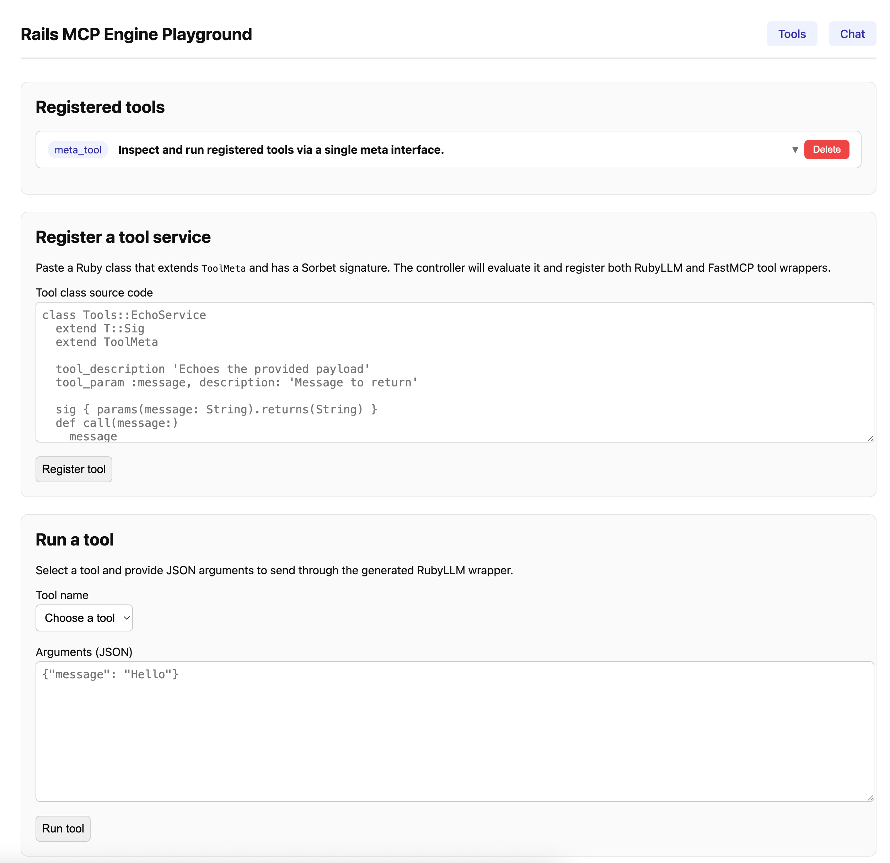
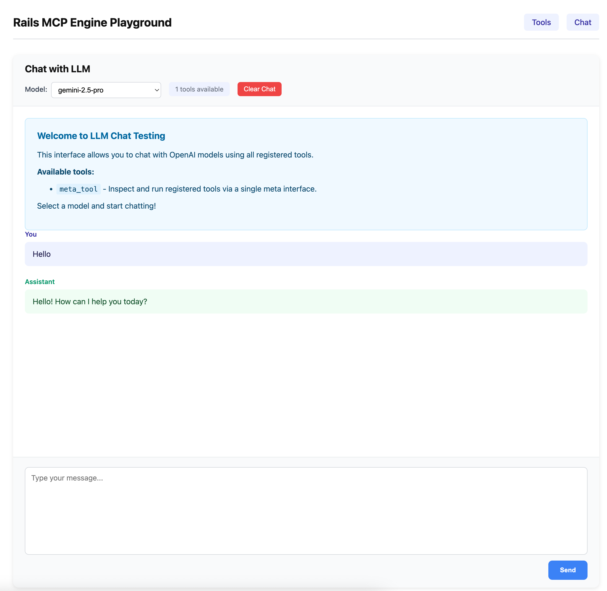

# Rails MCP Engine

Rails MCP Engine provides a unified tool-definition pipeline for Rails 8 applications. Service classes declare Sorbet-typed signatures and metadata once, and the engine auto-generates both RubyLLM and FastMCP tool classes at boot.

## Core Dependencies

This engine is built on top of these powerful libraries:

- **[RubyLLM](https://github.com/crmne/ruby_llm)**: For generating LLM-compatible tool definitions.
- **[FastMCP](https://github.com/yjacquin/fast-mcp)**: For creating Model Context Protocol (MCP) servers.
- **[Sorbet](https://github.com/sorbet/sorbet)**: For static type checking and signature definitions.


## Installation

Add this line to your application's Gemfile:

```ruby
gem 'rails_mcp_engine'
```

And then execute:

```bash
bundle install
```

## How it works

- **Service classes** live under the `Tools::` namespace, extend `ToolMeta`, and expose a single Sorbet-signed entrypoint (defaults to `#call`).
- **ToolMeta DSL** captures names, descriptions, and parameter metadata, while Sorbet signatures provide the type source of truth.
- The **ToolSchema pipeline** merges Sorbet type information with metadata, producing a unified schema AST.
- **Factories** (`ToolSchema::RubyLlmFactory` and `ToolSchema::FastMcpFactory`) transform the AST into RubyLLM tools and FastMCP `ApplicationTool` subclasses, respectively.
- The **Engine** automatically iterates through registered service classes and generates both tool types during Rails initialization (`to_prepare`).

## Defining a tool service

Create a service that extends `ToolMeta` and uses Sorbet for the entrypoint signature. Only business logic belongs here; tool wrappers are generated.

```ruby
# app/services/tools/book_meeting_service.rb
class Tools::BookMeetingService
  extend T::Sig
  extend ToolMeta

  tool_name "book_meeting"
  tool_description "Books a meeting."
  tool_param :window, description: "Start/finish window"
  tool_param :participants, description: "Email recipients"

  sig do
    params(
      window: T::Hash[Symbol, String],
      participants: T::Array[String]
    ).returns(T::Hash[Symbol, T.untyped])
  end
  def call(window:, participants:)
    # ... business logic ...
  end
end
```

On boot, the engine generates:
- `Tools::BookMeeting < RubyLLM::Tool` with a matching `params` block.
- `Mcp::BookMeetingTool < ApplicationTool` with a matching `arguments` block.

## Default meta tool

`Tools::MetaToolService` is included by default to explore and execute registered tools at runtime. It exposes a single `action` argument with supporting keywords:

- `list`: return full tool details (name, description, params, return type).
- `list_summary`: return only names and descriptions.
- `search`: provide `query` to fuzzy-match name/description.
- `get`: provide `tool_name` to fetch a full schema payload.
- `run`: provide `tool_name` and `arguments` to invoke a tool through its service class.

> **Note:** The `register` action is not available via the tool interface for security reasons. Developers can manually register tools using `Tools::MetaToolService.new.register_tool("ClassName")` in their code.

Example invocation from a console:

```ruby
Tools::MetaToolService.new.call(action: 'run', tool_name: 'book_meeting', arguments: { window: { start: '...', finish: '...' }, participants: ['a@example.com'] })
```

## Tool Registration Hooks

You can attach `before_call` and `after_call` hooks when manually registering tools. These hooks are useful for logging, tracing, or other side effects.

```ruby
Tools::MetaToolService.new.register_tool(
  'Tools::BookMeetingService',
  before_call: ->(args) { Rails.logger.info("Calling tool with #{args}") },
  after_call: ->(result) { Rails.logger.info("Tool returned #{result}") }
)
```

- `before_call`: A `Proc` that receives the arguments hash.
- `after_call`: A `Proc` that receives the result.

These hooks are executed around the tool's entrypoint method for both RubyLLM and FastMCP wrappers.

## Using Tools in Host Application

You can easily fetch the generated RubyLLM tool classes for use in your host application (e.g., when calling an LLM API):

```ruby
# Fetch specific tool classes by name
tool_classes = Tools::MetaToolService.ruby_llm_tools(['book_meeting', 'calculator'])

# Use them with RubyLLM
response = RubyLLM.chat(
  messages: messages,
  tools: tool_classes,
  model: 'gpt-4o'
)
```


## Development

After checking out the repo, run `bundle install` to install dependencies. Then, run `bundle exec rails test` to run the tests.

To install this gem onto your local machine, run `bundle exec rake install`. To release a new version, update the version number in `version.rb`, and then run `bundle exec rake release`, which will create a git tag for the version, push git commits and the created tag, and push the `.gem` file to [rubygems.org](https://rubygems.org).

### Playground & Chat

The engine includes a built-in playground and chat interface for testing your tools.

1.  **Mount the engine**: Ensure the engine is mounted in your `config/routes.rb` (e.g., `mount RailsMcpEngine::Engine => '/rails_mcp_engine'`).
2.  **Access the Playground**: Navigate to `/rails_mcp_engine/playground` to register and test tools individually.
3.  **Access the Chat**: Navigate to `/rails_mcp_engine/chat` to test tools within a conversational interface using OpenAI models.

The playground allows you to:
- Register tool services dynamically by pasting Ruby code.
- Run registered tools with JSON arguments.
- View tool schemas and details.

The chat interface allows you to:
- Chat with OpenAI models (e.g., gpt-4o).
- Automatically invoke registered tools during the conversation.
- View tool calls and results within the chat history.

Screenshots:

| Playground | Chat |
| --- | --- | 
|  |  |

## License

The gem is available as open source under the terms of the [MIT License](https://opensource.org/licenses/MIT).
